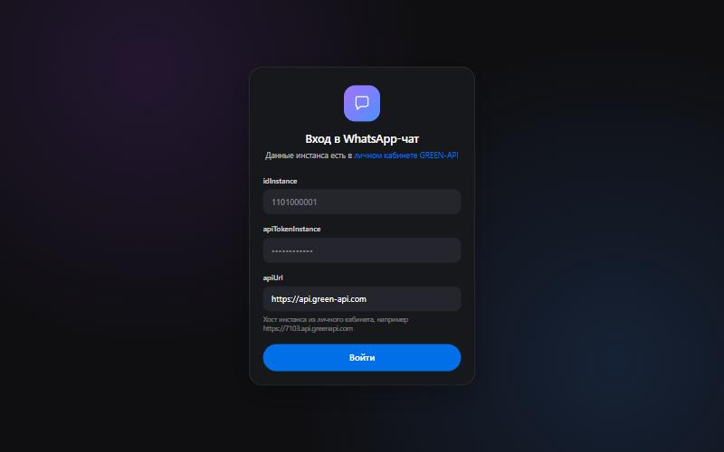
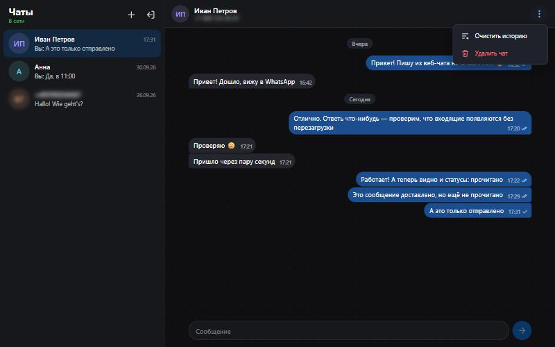
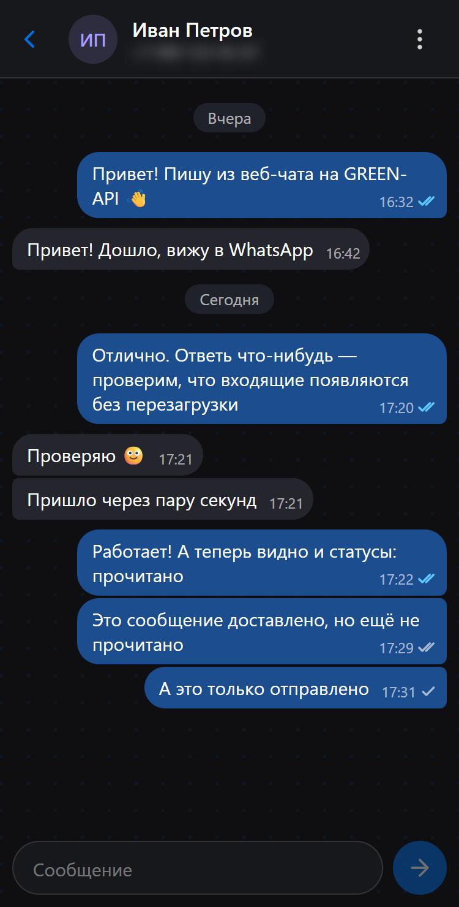

# WhatsApp-чат на GREEN-API

Минимальный веб-чат для отправки и получения текстовых сообщений WhatsApp через [GREEN-API](https://green-api.com).
Внешний вид по мотивам [web.max.ru](https://web.max.ru): две колонки, слева список чатов, справа переписка.

**Демо:** https://green-api-testovoe-murex.vercel.app/

| Вход                                | Чат                               | Мобильная версия                          |
| ----------------------------------- | --------------------------------- | ----------------------------------------- |
|  |  |  |

## Возможности

- Вход по `idInstance` и `apiTokenInstance`. Перед сохранением вызывается `getStateInstance`: если инстанс не привязан к WhatsApp или спит, выводится понятная ошибка.
- Создание чата по номеру телефона в любом формате (`+7 900 123-45-67`, `8 900...`).
- Отправка текста (`sendMessage`): `Enter` отправляет, `Shift+Enter` переносит строку, пустое сообщение не отправляется.
- Получение входящих через HTTP API (`receiveNotification` / `deleteNotification`), ответ появляется через несколько секунд без перезагрузки.
- Сообщения, отправленные с телефона, тоже появляются в чате как свои.
- Сессия, список чатов и история сохраняются в `localStorage` и переживают перезагрузку. «Выйти» удаляет креды.
- Статусы сообщений как в мессенджерах: часы (отправляется), одна галочка (отправлено), две серые (доставлено), две синие (прочитано), «не отправлено» с повторной отправкой. Статусы приходят вебхуком `outgoingMessageStatus` и никогда не откатываются назад, даже если вебхуки пришли не по порядку.
- Адреса у чатов: `/chat/79001234567`. Работают ссылки, перезагрузка и «назад» в браузере; без входа адрес запоминается, и после входа откроется нужный чат.
- Лоадеры: страницы грузятся лениво (полоса прогресса при переходе, полноэкранный лоадер при первом открытии), спиннеры при проверке инстанса и подключении.
- Действия с чатом в меню «⋯» в шапке: «Очистить историю» и «Удалить чат» (убирает чат из списка вместе с историей). Оба действия с подтверждением и только на сайте, в `localStorage` этого браузера; в WhatsApp ничего не меняется. Новое сообщение с удалённого номера вернёт чат в список.
- Адаптивная вёрстка от 360 px, тёмная и светлая тема по настройке системы.

## Стек

| Задача         | Решение                                                                                   |
| -------------- | ----------------------------------------------------------------------------------------- |
| Сборка         | Vite, TypeScript (strict)                                                                 |
| UI             | React 19, CSS Modules (без UI-библиотек)                                                  |
| Архитектура    | [Feature-Sliced Design](https://feature-sliced.design), проверяется линтером steiger      |
| Роутинг        | React Router 8: защищённые маршруты, ленивые страницы                                     |
| Запросы        | TanStack Query (вход, настройки инстанса, отправка) поверх нативного `fetch`              |
| Валидация      | Zod: ответы API, вебхуки, формы и данные из `localStorage`; типы выводятся из схем        |
| Формы          | React Hook Form + `zodResolver`                                                           |
| Состояние чата | Context + `useReducer`, синхронизация с `localStorage`                                    |
| Качество       | ESLint (typescript-eslint strict, react-hooks, TanStack Query), Prettier, steiger, Vitest |

Бэкенда нет: браузер обращается к GREEN-API напрямую (CORS у GREEN-API открыт).

## Локальный запуск

Нужен Node.js 22.22+ (требование React Router 8).

```bash
git clone https://github.com/litvnvdev/green-api-testovoe.git
cd green-api-testovoe
npm install
npm run dev
```

Откройте http://localhost:5173 и введите данные инстанса.

### Где взять `idInstance` и `apiTokenInstance`

1. Зарегистрируйтесь в [личном кабинете GREEN-API](https://console.green-api.com).
2. Создайте инстанс (тариф «Developer» бесплатный).
3. На странице инстанса скопируйте `idInstance`, `apiTokenInstance` и `apiUrl`.
   У каждого инстанса свой хост (например, `https://7103.api.greenapi.com`). Его нужно указать в поле `apiUrl` на форме входа.
   Общий `https://api.green-api.com` тоже работает.

### Как привязать WhatsApp к инстансу

1. В личном кабинете откройте инстанс и нажмите «Сканировать QR-код».
2. На телефоне: WhatsApp → «Настройки» → «Связанные устройства» → «Привязка устройства», отсканируйте QR-код.
3. Дождитесь статуса `authorized`.
4. В «Настройках» инстанса включите:
   - **Receive webhooks on incoming messages and files** — без этого ответы не придут;
   - **Receive webhooks on sent messages statuses** — для отметок «доставлено» и «прочитано»;
   - по желанию **Receive webhooks on messages sent from phone** — чтобы видеть в чате сообщения, отправленные с телефона.

   Поле **Webhook Url** оставьте пустым. Сохраните и подождите несколько минут.

### Сквозная проверка

1. Войдите с данными инстанса.
2. Нажмите «+», введите номер другого телефона с WhatsApp и нажмите «Создать».
3. Отправьте сообщение: оно придёт на этот телефон.
4. Ответьте с телефона: ответ появится в чате через несколько секунд.

### Если ответы не приходят

1. В личном кабинете → инстанс → «Настройки» должно быть включено «Получать уведомления о входящих сообщениях» (`incomingWebhook`), а поле URL для вебхуков (`webhookUrl`) — пустым. Иначе уведомления не попадают в очередь HTTP API. Приложение проверяет это через `getSettings` и показывает предупреждение; проверка повторяется при возврате на вкладку, так что после исправления настроек перезагружать страницу не нужно. Изменения настроек применяются в течение нескольких минут.
2. Откройте чат только в одной вкладке: очередь у инстанса одна, и сообщение забирает тот, кто успел первым (другая вкладка, Postman, бот на этом же инстансе).
3. Статус под заголовком «Чаты» должен быть «В сети».

## Команды

| Команда            | Что делает                                                           |
| ------------------ | -------------------------------------------------------------------- |
| `npm run dev`      | dev-сервер                                                           |
| `npm run build`    | проверка типов и production-сборка в `dist/`                         |
| `npm run preview`  | просмотр production-сборки                                           |
| `npm run lint`     | ESLint, проверка форматирования Prettier и FSD-архитектуры (steiger) |
| `npm run lint:fsd` | только проверка FSD                                                  |
| `npm run format`   | автоформатирование Prettier                                          |
| `npm test`         | юнит-тесты: схемы, телефон, разбор вебхуков, статусы, reducer        |

## Деплой

Приложение развёрнуто на Vercel: проект подключён к репозиторию, каждый push в `main` публикуется автоматически (Framework preset: Vite, команда `npm run build`, папка `dist`).
GitHub Actions ([`.github/workflows/ci.yml`](.github/workflows/ci.yml)) на каждый push и pull request запускает линтер, тесты и сборку.

Маршруты клиентские, поэтому хостинг должен отдавать `index.html` на любой путь: для Vercel это настроено в [`vercel.json`](vercel.json).

## Как устроено

Код разложен по слоям [Feature-Sliced Design](https://feature-sliced.design). Слой может импортировать только нижележащие слои, а каждый слайс — только через свой `index.ts` (public API). Это проверяет `npm run lint` (steiger).

```
src/
  app/                       точка входа: провайдеры, роутер, гарды, глобальные стили
    routes/                  App, router, RequireAuth / GuestOnly, AuthorizedArea, RootLayout
  pages/
    login/                   страница входа
    chats/                   двухколоночный layout + заглушка «выберите чат»
    chat/                    /chat/:phone — переписка, «нет такого чата», «неверный номер»
  widgets/
    sidebar/                 список чатов, статус подключения, новый чат, выход
    chat-window/             шапка чата, сообщения, ввод
  features/
    auth/                    форма входа (RHF + Zod + useMutation), выход
    create-chat/             форма нового чата
    send-message/            ввод сообщения, отправка (useMutation), повтор
    manage-chat/             меню «⋯»: очистить историю, удалить чат
    receive-messages/        polling уведомлений, статус подключения, проверка настроек (useQuery)
  entities/
    session/                 креды и вход/выход
    chat/                    хранилище чатов инстанса, схема данных, элемент списка
    message/                 схема и тип сообщения, статусы, список сообщений
  shared/
    api/                     клиент GREEN-API, Zod-схемы ответов и вебхуков, QueryClient
    lib/                     телефон, даты, localStorage, DOM-утилиты
    ui/                      Avatar, IconButton, TextField, Spinner, PageLoader, ProgressBar, иконки
    config/                  маршруты, ссылки
```

**Типы из схем.** Все типы данных выводятся из Zod-схем (`z.infer`), поэтому проверка в рантайме и типы не расходятся.
Например, схема сообщения в `entities/message` собрана из схемы события вебхука в `shared/api` (`omit` + `extend`), а одна схема кредов проверяет и форму входа, и сессию из `localStorage`.
Ответы GREEN-API тоже проверяются схемой: неожиданный формат превращается в понятную ошибку, а не в падение интерфейса.

**Запросы.** Вход и отправка — мутации TanStack Query, настройки инстанса — запрос с повтором при возврате на вкладку.
В ключах запросов только `idInstance`, токен туда не попадает.
Получение уведомлений осталось отдельным циклом: это не кэшируемые данные, а очередь, которую нужно разбирать строго по одному сообщению (получить → удалить → следующее) с паузами при ошибках. `refetchInterval` для этого не подходит.

**Получение сообщений.** `usePolling` выполняет цикл: `receiveNotification`, обработка, `deleteNotification`, сразу следующий запрос.
Следующий шаг планируется через `setTimeout` только после завершения предыдущего, поэтому запросы не накладываются.
`receiveNotification` вызывается с `receiveTimeout=5` (long polling): при пустой очереди сервер сам ждёт до 5 секунд, затем клиент делает паузу 2 секунды.
Каждое уведомление удаляется, в том числе проигнорированные (медиа, группы, неизвестные типы). При размонтировании или выходе цикл останавливается через `AbortController`.
При сетевых ошибках и `429` повтор идёт с растущей паузой (до 30 секунд). При `401/403` цикл останавливается и предлагает войти заново.

**Дедупликация.** Сообщения хранятся с `idMessage` из GREEN-API. Повторно доставленное уведомление не создаёт дубль.
Отправленное сообщение сначала показывается с временным id, после ответа `sendMessage` получает настоящий `idMessage`.
Если вебхук `outgoingAPIMessageReceived` пришёл раньше ответа API, локальная копия удаляется.

**Хранение.** Креды лежат в `localStorage` под ключом `greenApiChat:credentials`, история хранится отдельно для каждого инстанса (`greenApiChat:data:<idInstance>`), не больше 500 сообщений на чат.
Сохранённые данные проверяются при чтении, повреждённые игнорируются.

## Известные ограничения

- Только текст и только личные чаты. Медиа, группы, поиск и уведомления не поддерживаются (вне объёма задания).
- Статус, пришедший раньше ответа `sendMessage` (у сообщения ещё временный id), пропускается; на практике это только «отправлено», которое и так выставляется по ответу API.
- История есть только с момента входа: GREEN-API отдаёт новые события, старую переписку приложение не загружает.
- Очередь уведомлений у инстанса одна. Если открыть чат в двух вкладках, сообщение получит та, что успеет первой; другая его не увидит до перезагрузки.
- Токен хранится в `localStorage` в открытом виде, как требует задание. На общем компьютере нужно нажимать «Выйти».
- После выхода история остаётся в браузере и вернётся при следующем входе в тот же инстанс.
- Если в очереди инстанса накопились старые уведомления (хранятся 24 часа), после входа они будут загружены и попадут в историю.
- Бесплатный тариф Developer разрешает писать только в ограниченное число чатов; при превышении приходит ошибка `466`, она показывается в чате.
